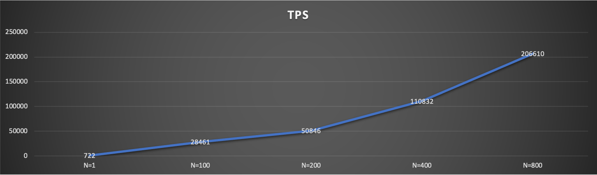
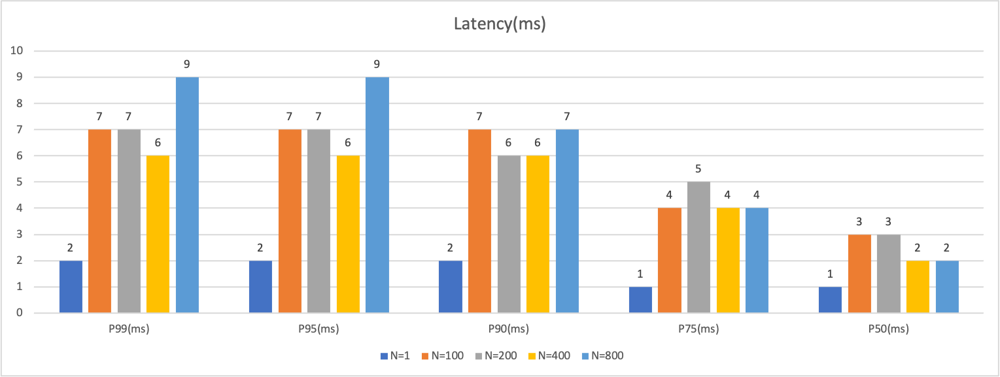

# Golang SmartBatching
An implementation smartmatching in golang based on [Smart Batching](https://mechanical-sympathy.blogspot.com/2011/10/smart-batching.html)

## Example
> A complete example of balance hotspot account with TPS(~100K), please check [example](./examples)
### Build and run
```bash
go build balance.go

./balance -a="mysql adress"
```
### Benchmark
We do it with 10 request/thread and mysql(local)

#### TPS( higher is better)

#### Latency(lower is better)

## **Documentation**
- Blog:
    - [Smart Batching](https://mechanical-sympathy.blogspot.com/2011/10/smart-batching.html)
